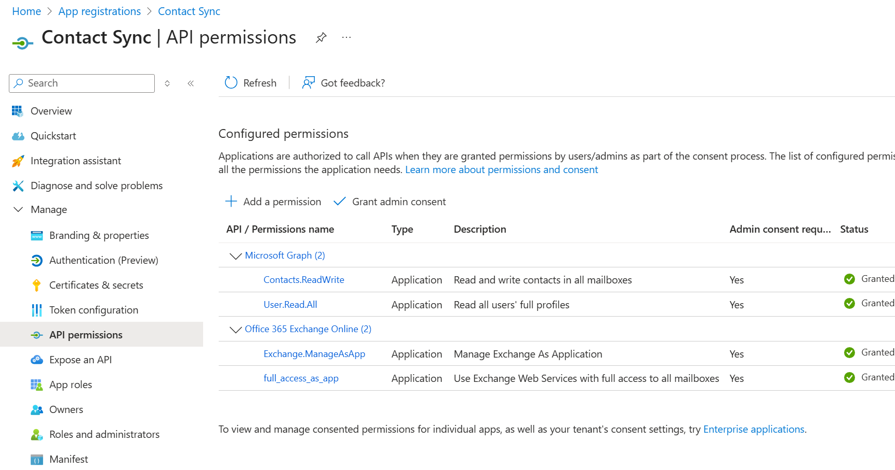

# Graph Contact Sync

Synchronizes Global Address List and Organizational Contacts from a M365 environment to selected/all mailboxes in the directory. Uses the MS Graph API PowerShell module to perform all operations.

Heavily inspired by the excellent [EWS-Office365-Contact-Sync](https://github.com/grahamr975/EWS-Office365-Contact-Sync) code by grahamr975.

Uses [PoShLog](https://github.com/PoShLog/PoShLog) for structured console/file logs.

## History

My company needed a centralized/automated method to ditribute corporate contact lists to all employees' phones/Exchange mailboxes. There is a shocking lack of good affordable tooling for what seems like a common use case. So I wrote this.

Please see the **Acknowledgements** section for attribution of the idea that started this all off.

## Features

- Includes Org-level contacts from M365 > Users > Contacts. Useful for non-person contacts such as office/branch information.
- Compares old and new field values so it only replaces a contact entry if change detected.
- **Automatic photo change detection**: Detects when user profile photos change and automatically updates them across all synchronized contacts. Uses Microsoft Graph photo metadata to efficiently track changes without re-downloading unchanged photos.
- **FileAs field formatting**: Configure how contacts are filed ("First Last" or "Last, First" format).
- **Categories support**: Assign categories to contacts, useful when syncing to main Contacts folder.

## Security

### Certificate Authentication Methods

This script supports three authentication methods, listed in order of security (most secure first):

1. **Certificate Thumbprint (Recommended)**: Uses certificates installed in the Windows Certificate Store. No password storage required.
2. **Encrypted Password File**: Stores the PFX password in an encrypted file that can only be decrypted by the same user on the same machine.
3. **Plaintext Password**: Stores the password in plaintext in scripts or command line. **Not recommended for production use.**

### Security Best Practices

- **Use Certificate Thumbprint authentication** whenever possible for the highest security
- **Never commit plaintext passwords** to source control
- **Store encrypted password files securely** and restrict access
- **Regularly rotate certificates** and update thumbprints
- **Use least privilege principles** when assigning Azure application permissions

### Creating Encrypted Password Files

If you have existing PFX files and need to create encrypted password files:

```powershell
.\Getting Started\Create-EncryptedPassword.ps1 -OutputPath "C:\Certs\certificate.cred"
```

## Parameters

### Required Parameters
- `ExchangeOrg`: The Exchange Organization to connect to
- `ClientID`: The Client ID for the application
- `MailboxList`: The list of mailboxes to sync contacts to (or "DIRECTORY" for all)
- `ManagedContactFolderName`: The name of the folder to sync contacts to
- `LogPath`: The path to the log file

### Certificate Authentication Parameters (Choose One Method)

#### Method 1: Certificate Thumbprint (Recommended - Most Secure)
- `CertificateThumbprint`: The thumbprint of the certificate installed in the Windows Certificate Store

#### Method 2: PFX File with Encrypted Password File  
- `CertificatePath`: The path to the certificate PFX file
- `CertificatePasswordFile`: The path to an encrypted password file

#### Method 3: PFX File with Plaintext Password (Not Recommended)
- `CertificatePath`: The path to the certificate PFX file  
- `CertificatePassword`: The certificate password (security risk - use other methods instead)

### Optional Parameters
- `FileAsFormat`: How to format the FileAs field. Valid values:
  - `"FirstLast"` (default): "John Smith"
  - `"LastFirst"`: "Smith, John"
- `Categories`: Array of categories to assign to contacts. Example: `@("Business Contacts", "Company Directory")`

## Notes and disclaimers

- Test this thoroughly before deploying in any automated/unconstrained way. This application has permissions to **DELETE** contacts from mailboxes, so be wary.
- This works for my own company, but seems only fitting to release a variant of the project that inspired its creation for others to use/modify for their own needs.
- I am fairly new to writing PowerShell, and it probably shows. There are a few known issues and improvements that I will work on as time allows. These will be documented as GitHub Issues.
- **PRs welcome!** There is no formal Code of Conduct for this (yet), other than "be nice". Unfortunately this has to be said these days, but in general if you wouldn't want to see/experience certain behavior, then don't do it yourself.

## Getting Started

This guide will walk you through setting up GraphContactSync to automatically synchronize your organization's contacts to user mailboxes. The process involves creating certificates for secure authentication, registering an Azure application, and configuring the script.

### Overview

```
┌─────────────────┐    ┌──────────────────┐    ┌─────────────────┐
│   Certificate   │    │  Azure App       │    │  PowerShell     │
│   Generation    │───▶│  Registration    │───▶│  Script Setup   │
│                 │    │                  │    │                 │
└─────────────────┘    └──────────────────┘    └─────────────────┘
         │                        │                        │
         ▼                        ▼                        ▼
┌─────────────────┐    ┌──────────────────┐    ┌─────────────────┐
│ .pfx & .cer     │    │ Client ID &      │    │ Contact Sync    │
│ files created   │    │ Permissions      │    │ to Mailboxes    │
└─────────────────┘    └──────────────────┘    └─────────────────┘
```

### Prerequisites

1. **Install Required PowerShell Modules**
   ```powershell
   # Install Exchange Online PowerShell module
   Install-Module ExchangeOnlineManagement
   
   # Install PoShLog for structured console/file logging
   Install-Module PoShLog
   ```

2. **Get Your Organization Information**
   
   You'll need your Office 365 organization URL (ends in `.onmicrosoft.com`). To find this:
   - Navigate to **Microsoft 365 Admin Center** → **Settings** → **Domains**
   - Look for your primary domain ending in `.onmicrosoft.com`
   - Example: `mycompany.onmicrosoft.com`

### Step 1: Create Certificates

Use the provided script to generate certificates for secure authentication:

```powershell
# Navigate to the Getting Started folder
cd "Getting Started"

# Create certificates (recommended: use -CreatePasswordFile for encrypted storage)
.\Create-Certificates.ps1 -CertificateName contactsync.mydomain.com -CertificatePassword 'myPassword!' -CreatePasswordFile

# Important: Do NOT use -RemoveCert if you want thumbprint authentication (most secure)
```

This creates the following files:
- `contactsync.mydomain.com.pfx` - Contains private key + certificate (keep secure!)
- `contactsync.mydomain.com.cer` - Public certificate for Azure upload
- `contactsync.mydomain.com.cred` - Encrypted password file (if -CreatePasswordFile used)

The script will display a certificate thumbprint like: `1234567890ABCDEF...` - save this for later use.

### Step 2: Create Azure Application Registration

#### 2.1 Register New Application

1. Sign in to the **Azure Portal** (https://portal.azure.com)
2. Navigate to **Azure Active Directory** → **App registrations**
3. Click **New registration**

   > 📸 *A screenshot showing the "New registration" button in Azure Portal would be helpful here*

4. Configure the application:
   - **Name**: `GraphContactSync` (or your preferred name)
   - **Supported account types**: Select "Accounts in this organizational directory only"
   - **Redirect URI**: Leave blank for now
   - Click **Register**

   > 📸 *A screenshot of the application registration form would be helpful here*

5. **Record the Application (client) ID** - you'll need this later
   - Found on the app's Overview page under "Application (client) ID"

   > 📸 *A screenshot highlighting where to find the Application ID would be helpful here*

#### 2.2 Configure Authentication

1. In your app registration, go to **Authentication**
2. Click **Add a platform**

   > 📸 *A screenshot showing the Authentication page and "Add a platform" button would be helpful here*

3. Select **Mobile and desktop applications**
4. Add this redirect URI: `https://login.microsoftonline.com/common/oauth2/nativeclient`
5. Under **Advanced settings**, enable **Allow public client flows** → Set to **Yes**

   > 📸 *A screenshot showing the redirect URI configuration and public client flows setting would be helpful here*

6. Click **Save**

#### 2.3 Upload Certificate

1. Go to **Certificates & secrets**
2. Click **Upload certificate**

   > 📸 *A screenshot showing the Certificates & secrets page would be helpful here*

3. Select your `.cer` file created in Step 1 (e.g., `contactsync.mydomain.com.cer`)
4. Add a description: "GraphContactSync Certificate"
5. Click **Add**

#### 2.4 Configure API Permissions

1. Go to **API permissions**
2. Click **Add a permission**
3. Select **Microsoft Graph**

   > 📸 *A screenshot showing the API selection page would be helpful here*

4. Choose **Application permissions**
5. Add these specific permissions:
   - **Contacts.ReadWrite** - Read and write contacts in all mailboxes
   - **User.Read.All** - Read all users' full profiles (includes organizational contacts and photos)

   > 📸 *A screenshot showing how to search for and select these permissions would be helpful here*

6. Click **Add permissions**
7. **Important**: Click **Grant admin consent for [Your Organization]**
8. Confirm by clicking **Yes**

After completion, your API permissions should look like this:



*This screenshot shows the correctly configured permissions with admin consent granted.*

**Note**: If you have existing Exchange Online permissions (`Exchange.ManageAsApp` or `full_access_as_app`) from previous versions, these can be safely removed as they are no longer required.

#### 2.5 Alternative: Configure via Manifest (Advanced Users)

Instead of using the UI, you can directly edit the application manifest:

1. Go to **Manifest**
2. Find the `"requiredResourceAccess"` section
3. Replace it with:
   ```json
   "requiredResourceAccess": [
       {
           "resourceAppId": "00000003-0000-0000-c000-000000000000",
           "resourceAccess": [
               {
                   "id": "6918b873-d17a-4dc1-b314-35f528134491",
                   "type": "Role"
               },
               {
                   "id": "df021288-bdef-4463-88db-98f22de89214",
                   "type": "Role"
               }
           ]
       }
   ]
   ```
4. Click **Save**
5. Still need to grant admin consent as described in step 2.4
### Step 3: Test the Script

Before deploying to all mailboxes, test with a single mailbox using one of these secure authentication methods:

#### Method 1: Certificate Thumbprint (Recommended - Most Secure)

```powershell
# Create a test script file: TestRun.ps1
.\GraphContactSync.ps1 `
    -ExchangeOrg "mycompany.onmicrosoft.com" `
    -ClientID "your-application-client-id-here" `
    -CertificateThumbprint "your-certificate-thumbprint-here" `
    -MailboxList "testuser@mycompany.com" `
    -ManagedContactFolderName "Company Contacts - Test" `
    -LogPath "$PSScriptRoot\Logs" `
    -FileAsFormat "LastFirst" `
    -Categories @("Business Contacts", "Company Directory")
```

#### Method 2: Encrypted Password File (Secure Alternative)

```powershell
.\GraphContactSync.ps1 `
    -ExchangeOrg "mycompany.onmicrosoft.com" `
    -ClientID "your-application-client-id-here" `
    -CertificatePath "C:\Path\To\contactsync.mydomain.com.pfx" `
    -CertificatePasswordFile "C:\Path\To\contactsync.mydomain.com.cred" `
    -MailboxList "testuser@mycompany.com" `
    -ManagedContactFolderName "Company Contacts - Test" `
    -LogPath "$PSScriptRoot\Logs" `
    -FileAsFormat "LastFirst" `
    -Categories @("Business Contacts", "Company Directory")
```

#### Method 3: Plaintext Password (Not Recommended for Production)

```powershell
# Only use for initial testing - not recommended for production
.\GraphContactSync.ps1 `
    -ExchangeOrg "mycompany.onmicrosoft.com" `
    -ClientID "your-application-client-id-here" `
    -CertificatePath "C:\Path\To\contactsync.mydomain.com.pfx" `
    -CertificatePassword "YourCertificatePassword" `
    -MailboxList "testuser@mycompany.com" `
    -ManagedContactFolderName "Company Contacts - Test" `
    -LogPath "$PSScriptRoot\Logs"
```

**Replace the following placeholders:**
- `mycompany.onmicrosoft.com` - Your organization's URL from Prerequisites
- `your-application-client-id-here` - Application ID from Step 2.1
- `your-certificate-thumbprint-here` - Thumbprint from Step 1
- `testuser@mycompany.com` - A test mailbox for initial testing
- Update certificate paths to match your actual file locations

### Step 4: Deploy to All Mailboxes

Once you've successfully tested with a single mailbox and verified the contacts are syncing correctly:

1. **Deploy to all mailboxes** by changing the MailboxList parameter:
   ```powershell
   -MailboxList "DIRECTORY"
   ```

2. **Create a production script** with your final settings:
   ```powershell
   # ProductionRun.ps1
   .\GraphContactSync.ps1 `
       -ExchangeOrg "mycompany.onmicrosoft.com" `
       -ClientID "your-application-client-id-here" `
       -CertificateThumbprint "your-certificate-thumbprint-here" `
       -MailboxList "DIRECTORY" `
       -ManagedContactFolderName "Company Contacts" `
       -LogPath "$PSScriptRoot\Logs" `
       -FileAsFormat "LastFirst" `
       -Categories @("Business Contacts")
   ```

### Step 5: Schedule Automated Runs (Optional)

For automated synchronization, set up a scheduled task:

1. Open **Task Scheduler** on your server/workstation
2. Create a new task with these settings:
   - **General**: Run whether user is logged on or not
   - **Triggers**: Set your desired schedule (e.g., daily at 6 AM)
   - **Actions**: 
     - Program: `PowerShell.exe`
     - Arguments: `-ExecutionPolicy Bypass -File "C:\Path\To\Your\ProductionRun.ps1"`
     - Start in: `C:\Path\To\Your\GraphContactSync\Directory`
3. **Important**: Use a service account with appropriate permissions
4. Test the scheduled task manually before relying on it

### Troubleshooting Tips

- **Check logs** in the specified LogPath directory for detailed error information
- **Verify permissions** in Azure portal if you get authentication errors
- **Test with a single mailbox first** before deploying to all users
- **Monitor the first few runs** to ensure contacts are syncing as expected
- **Certificate expiration**: Plan to renew certificates before they expire (typically 1-2 years)

### Quick Reference

Once you've completed the setup, here are the key files and information you'll need:

| Item | Location/Value | Purpose |
|------|---------------|---------|
| Certificate Thumbprint | From Step 1 output | Most secure authentication method |
| Application (Client) ID | Azure Portal → App Registration → Overview | Required for script authentication |
| Organization URL | `yourcompany.onmicrosoft.com` | Your M365 tenant identifier |
| PFX File | `contactsync.mydomain.com.pfx` | Certificate with private key |
| CER File | `contactsync.mydomain.com.cer` | Public certificate for Azure upload |
| Encrypted Password | `contactsync.mydomain.com.cred` | Secure password storage (if used) |

### Security Reminders

- **Always use Certificate Thumbprint authentication** for production environments
- **Keep your .pfx files secure** - they contain private keys
- **Don't commit certificates or passwords** to source control  
- **Regularly review and rotate** your certificates
- **Monitor the application logs** for any security-related issues

## Photo Handling

The script automatically downloads and tracks user profile photos:

- **Photos Directory**: Photos are stored in a `Photos\` subdirectory (automatically created)
- **Change Detection**: The script tracks photo metadata and automatically detects when profile photos change
- **Automatic Updates**: When photo changes are detected, the script removes old photos and downloads new ones
- **Efficient Sync**: Only downloads photos when they're missing or changed, avoiding unnecessary re-downloads

No manual intervention is required for photo management - the script handles all photo synchronization automatically.

## License

This project is licensed under the MIT License - see the [LICENSE.md](LICENSE.md) file for details

## Acknowledgements

- Thanks to **Ryan Graham** for the [EWS-Office365-Contact-Sync](https://github.com/grahamr975/EWS-Office365-Contact-Sync) code, but moreso the concept of this process.
